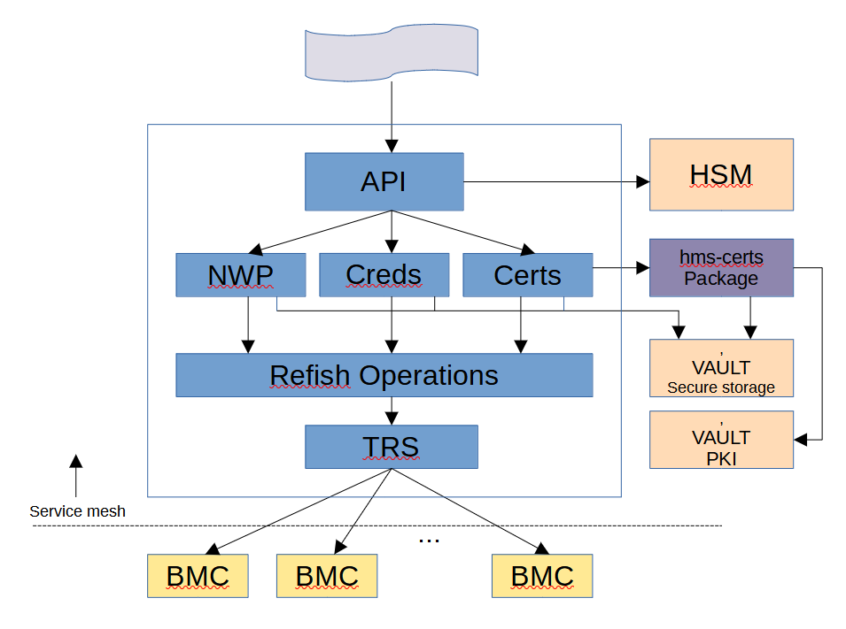

# System Configuration Tool

Various BMC parameters are set during the system HW discovery process.  There will be times, however, when certain parameters need to be set outside of the discovery process.  Parameters commonly needing to be set:

* SSH keys
* NTP server
* Syslog server
* BMCs Redfish admin account passwords
* TLS certs for BMCs

**SCSD** is a service which allow these sorts of parameters to be set (or read) at any time.  SCSD can be accessed via its REST API or via the *cray* command-line tool.


## Operation



The SCSD service will present a REST API to facilitate parameter get/set operations.  It will typically contact the Hardware State Manager to verify targets as being correct and in a valid state.  Once it has a list of targets, SCSD will perform the needed Redfish operations in parallel.  Any credentials needed will be fetched from Vault secure storage.

*NOTE: in all POST operation payloads there is an optional "Force" field.  If present, and set to 'true', then the Hardware State Manager will not be utilized; the Redfish operations will be attempted without verifying they are present or in a good state.   If the "Force" field is not present or is present but set to 'false', target states will be verified, and any targets not in acceptable states will not be included in the operation.*

The specified targets can be BMC XNames, or Hardware State Manager Group IDs.  If BMCs are grouped in the Hardware State Manager, the usage of this tool becomes much easier since single targets can be used rather than long lists.


## Network Protocol Parameters

Network Protocol parameters set on BMCs include:

* SSH keys
* SSH Console keys
* NTP server 
* Syslog server

Note that at this time these are only settable on Olympus BMCs.  COTS BMCs
don't always support all of these, depending on the vendor; a near-future
enhancement will allow for setting whatever a COTS BMC will support.

The SCSD API allows for bulk listing and setting of Network Protocol parameters,
as well as fetching and setting of these parameters for a single target.

Please refer to the swagger doc in this repo: api/openapi.yaml, in the *nwp*
section for more details on the API and payloads.


## BMC Credentials

BMC credentials are username/password pairs used for Redfish administrative accounts.  BMC Redfish access used by Shasta requires the use of the administrative account and thus Shasta SW is responsible for setting and using the correct account credentials for BMC Redfish access.

BMC admin account passwords are created by the admin and set on the BMCs using 
the SCSD API.

The API has the ability to set credentials for collections of BMCs or
individual ones.  It also has the capability to fetch credentials for 
a collection of BMCs.

When setting creds for a collection of BMCs, there are 2 endpoints: one
that sets a different username/password for each target BMC, and one that
sets the same username/password for all target BMCs.  This gives maximum
ease and flexibility to the admin.

Please refer to the swagger doc in this repo: api/openapi.yaml, in the *creds*
section for more details on the API and payloads.


## TLS Cert Management

To facilitate validated HTTPS communications to Redfish BMCs, TLS certs need 
to be created and placed onto the BMCs.  The SCSD API provides the means to 
create, fetch, delete, and place TLS certs onto target BMCs.

The typical use case is that the admin will first want to create TLS certs for a
target set of BMCs using one SCSD API, and then apply the generated certs to 
the target BMCs with a different API.  Thus, this is not a single operation.

This is because generating the certs involves using the Shasta certificate 
trust chain service, which has nothing to do with the actual hardware.  Once
this is done, then the generated certs can be used.

Please refer to the swagger doc in this repo: api/openapi.yaml, in the *certs*
section for more details on the API and payloads.


## Service Health and Version

Includes *health*, *liveness* and *readiness* APIs.  These are used by 
the Kubernetes cluster manager to assess the health of a microservice.

The *health* endpoint checks various sub-systems and reports them in the
returned JSON payload.

The *liveness* endpoint returns a favorable return status with no JSON
payload, proving the service is running and is responsive.

The *readiness* endpoint returns a favorable return status with no JSON
payload if all supporting sub-systems are operational (e.g., vault and TRS),
and an error return status if not.

The *version* endpoint returns the current build version of SCSD in a JSON
payload.

Please refer to the swagger doc in this repo: api/openapi.yaml, in the
*version* and *cli_ignore* sections for more details on these API and payloads.


## CLI

The SCSD CLI will be the standard Cray CLI based on the Swagger specification for the service.  Thus, all of the usual syntaxes apply for things like authentication, etc.  This style of CLI will make the use of SCSD consistent with all other Cray CLIs.

Since the Cray CLI for SCSD is the same as all other CLIs, and is self-documenting, its usage will not be outlined in this document.

Quick Example:  cray scsd syslog update --syslog sms-ncn-w001:514 x0c0s0b0

This updates the syslog server info on BMC x0c0s0b0, having it now point to sms-ncn-w001 port 514.


## Use Cases

Following are various use cases for SCSD.  Many of them require a list of valid BMCs, which can be obtained via the following script:

```bash
#!/bin/bash

valid=""
invalid=""

for fff in `cray hsm inventory redfishEndpoints list --format json | jq '.RedfishEndpoints[] | select(.FQDN | contains("-rts") | not) | select(.DiscoveryInfo.LastDiscoveryStatus == "DiscoverOK") | select(.Enabled==true) | .ID' | sed 's/"//g'`; do
    echo "Pinging ${fff}..." ;
    curl -k https://${fff}/redfish/v1/ > /dev/null 2>&1
    if [[ $? == 0 ]]; then
        echo "${fff} PRESENT"
        valid="${valid},${fff}"
    else
        echo "${fff} NOT PRESENT"
        invalid="${invalid},${fff}"
    fi
done

valTargs=`echo ${valid} | sed 's/^,//' | sed 's/,$//'`
invalTargs=`echo ${invalid} | sed 's/^,//' | sed 's/,$//'`

echo " "
echo "VALID:"
echo $valTargs
echo " "
echo "INVALID:"
echo $invalTargs
echo " "

```

Output looks something like:

```
Pinging x0c0s0b0...
x0c0s0b0 PRESENT
Pinging x0c0s1b0...
x0c0s1b0 PRESENT
Pinging x0c0s2b0...
x0c0s2b0 NOT PRESENT

VALID:
x0c0s0b0,x0c0s1b0

INVALID:
x0c0s2b0
```

The VALID list of BMCs can be used in various payloads' "Target" elements.


### Set BMC Redfish Credentials: All BMCs Use the Same Creds

**1. Run the above script to determine the live BMCs in the system.**

**2. Use the output from the script to create a JSON file containing the BMC creds, placing the items in the VALID list into the "Targets" array, e.g.:**

```
bmc_creds_glb.json
 
{
  "Force": false,
  "Username": "root",
  "Password": "new.root.password"
  "Targets": [
    "x0c0s0b0", "x0c0s1b0"
  ]
}
```

**3. Run the cray cli to have SCSD apply the global creds to all target BMCs:**

```bash
# cray scsd bmc globalcreds create ./bmc_creds_glb.json
```

If the above cray cli command has any components that do not have the status of "OK", these must be retried until they work, or retries are exhausted and noted as failures.  Failed modules need to be taken out of the system until they are fixed.


### Set BMC Redfish Credentials: All BMCs Have Different Creds

**1. Get valid BMCs using the script above.**

**2. Use this list to create a JSON file containing the BMC creds, e.g.:**

```
bmc_creds_dsc.json
{
  "Force": true,
  "Targets": [
    {
      "Xname": "x0c0s0b0",
      "Creds": {
        "Username": "root",
        "Password": "pw-x0c0s0b0"
      }
    },
    {
      "Xname": "x0c0s0b1",
      "Creds": {
        "Username": "root",
        "Password": "pw-x0c0s0b1"
      }
    }
  ]
}
```

**3. Run the cray cli to have SCSD apply the discrete creds:**

```bash
# cray scsd bmc discreetcreds create ./bmc_creds_dsc.json
```

If the above cray cli command has any components that do not have the status of "OK", these must be retried until they work, or retries are exhausted and noted as failures.  Failed modules need to be taken out of the system until they are fixed.


### Network Parameters: Fetch Current Settings On BMCs

**1. Run the above script to determine the live BMCs in the system.**

**2. Create a JSON file containing the BMCs and parameters to fetch.**

```
bmc_nwp_fetch.json

{
  "Targets": [
    "x0c0s0b0","x0c0s1b0"
  ],
  "Params": [
    "NTPServerInfo"
  ]
}
```

**3. Execute the CLI to dump the current requested parameters.**

```bash
# cray scsd bmc dumpcfg create --json bmc_nwp_fetch.json
```

Output example:

```
{
  "Targets": [
    {
      "StatusCode": 0,
      "StatusMsg": "string",
      "Xname": "x0c0s0b0",
      "Params": {
        "NTPServerInfo": {
          "NTPServers": "sms-ncn-w001",
          "Port": 0,
          "ProtocolEnabled": true
        }
      }
    }
  ]
}
```

If the above cray cli command has any components that do not have the status of "OK", these must be retried until they work, or retries are exhausted and noted as failures.  Failed modules need to be taken out of the system until they are fixed.


### Network Parameters: Set Settings On BMCs

**1. Run the above script to determine the live BMCs in the system.**

**2. Create a JSON file containing the BMCs and parameters to set.**

```
bmc_nwp_set.json

{
  "Force": true,
  "Targets": [
    "x0c0s0b0"
  ],
  "Params": {
    "NTPServer": {
      "NTPServers": "sms-ncn-w001",
      "Port": 0,
      "ProtocolEnabled": true
    },
    "SyslogServer": {
      "SyslogServers": "sms-ncn-w001",
      "Port": 0,
      "ProtocolEnabled": true
    },
    "SSHKey": "xyzabc123...",
    "SSHConsoleKey": "xyzabc123..."
  }
}
```

**3. Execute the CLI to set the requested parameters onto target BMCs.**

```bash
# cray scsd bmc loadcfg create bmc_nwp_set.json
```

Output example:

```
{
  "Targets": [
    {
      "Xname": "x0c0s0b0",
      "StatusCode": 200,
      "StatusMsg": "OK"
    },
    {
      "Xname": "x0c0s1b0",
      "StatusCode": 200,
      "StatusMsg": "OK"
    }
  ]
}
```


### TLS Certs: Generate And Place TLS Certs On BMCs

**1. Use SCSD to Generate TLS Certs**

First create a JSON file containing all cabinet level cert creation info:

```
{
  "Domain": "Cabinet",
  "DomainIDs": [ "x0", "x1", "x2", "x3"]
}
 
Save this to 'cert_create.json'
```

```
# cray scsd bmc createcerts create --format json cert_create.json
{
  "DomainIDs": [
    {
      "ID": "x0",
      "StatusCode": 200,
      "StatusMsg": "OK"
    },
    {
      "ID": "x1",
      "StatusCode": 200,
      "StatusMsg": "OK"
    },
    {
      "ID": "x2",
      "StatusCode": 200,
      "StatusMsg": "OK"
    },
    {
      "ID": "x3",
      "StatusCode": 200,
      "StatusMsg": "OK"
    }
  ]
}
```

**2. Use SCSD To Apply TLS Certs To Target BMCs**

Eventually this step will include all BMCs.  For the near future (1.4), only Mountain BMCs are supported.

First create a JSON file specifying the endpoints:

```
{
  "Force": false,
  "CertDomain": "Cabinet",
  "Targets": [
    "x0c0s0b0","x0c0s1b0","x0c0s2b0", "x0c0s3b0"
  ]
}
```

Execute SCSD to set the certs on the target BMCs:

```
# cray scsd bmc setcerts create --format json cert_set.json
{
  "Targets": [
    {
      "ID": "x0c0s0b0",
      "StatusCode": 200,
      "StatusMsg": "OK"
    },
    {
      "ID": "x0c0s1b0",
      "StatusCode": 200,
      "StatusMsg": "OK"
    },
    {
      "ID": "x0c0s2b0",
      "StatusCode": 200,
      "StatusMsg": "OK"
    },
    {
      "ID": "x0c0s3b0",
      "StatusCode": 200,
      "StatusMsg": "OK"
    }
  ]
}
```


### TLS Certs: TLS Cert and CA Trust Bundle Rolling

At any point the TLS certs can be re-generated and replaced on Redfish BMCs.  The CA trust bundle can also be modified at any time.

When this is to be done, the following steps are needed:

1. Modify the CA trust bundle.  This is outside the scope of this document.  Please reference the Vault PKI docs in the reference list below.
2. Once the CA trust bundle is modified, each service will automatically pick up the new CA bundle data.  There is no manual step.
3. Re-generate the TLS cabinet-level certs as in step 1 above.
Place the TLS certs onto the Redfish BMCs as in step 2 above.


### SCSD CT Testing

In addition to the service itself, this repository builds and publishes cray-scsd-test images containing tests that verify SCSD
on live Shasta systems. The tests are invoked via helm test as part of the Continuous Test (CT) framework during CSM installs and
upgrades. The version of the cray-scsd-test image (vX.Y.Z) should match the version of the cray-scsd image being tested, both of
which are specified in the helm chart for the service.
